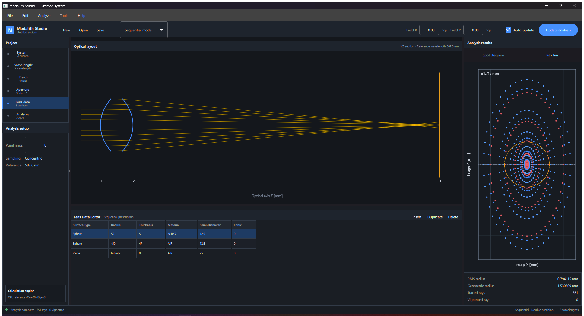

# Modalith Studio

**Open-source optical design and ray-tracing software for engineers, researchers, and students.**

[](https://github.com/FahriAybarsBarut/modalith-studio/actions/workflows/ci.yml)
[](https://github.com/FahriAybarsBarut/modalith-studio/releases/latest)
[](LICENSE)
[](https://isocpp.org/)
[](https://www.qt.io/)

Modalith Studio is a native Windows optical engineering application built with C++20 and Qt 6. It combines a professional lens-data workspace with deterministic sequential ray tracing, dispersive glass models, spot diagrams, and transverse ray-fan analysis. The long-term goal is a transparent, extensible engineering environment spanning optical and acoustic simulation.

> Modalith is under active development. Version 0.2.0 provides a tested optical-design foundation; it does not yet claim feature parity with commercial suites such as Ansys Zemax OpticStudio.



## Download for Windows

Download the latest installer or portable package from **[GitHub Releases](https://github.com/FahriAybarsBarut/modalith-studio/releases/latest)**.

- `Modalith-Studio-Setup-0.2.0.exe` — recommended Windows x64 installer
- `Modalith-Studio-0.2.0-Windows-x64.zip` — portable build, no installation required

Windows 10 or Windows 11 x64 is recommended. Published binaries are currently unsigned, so Microsoft Defender SmartScreen may ask for confirmation on first launch.

## What you can do

- Build and edit sequential optical systems in a professional Lens Data Editor
- Model plane, spherical, conic, and even-polynomial aspheric surfaces
- Apply per-surface aperture, material, thickness, decenter, and tilt data
- Trace rays using the vector Snell law with TIR detection and optical path length accumulation
- Evaluate polychromatic spot diagrams with RMS and geometric radius metrics
- Inspect tangential and sagittal transverse ray fans
- Use Sellmeier dispersion models for N-BK7, N-F2, and fused silica
- View the optical layout and analyses live while editing the system
- Save projects as versioned `.modalith` files and import legacy `.photon` projects
- Undo, redo, insert, delete, and duplicate optical surfaces
- Export spot and ray-fan data to CSV for external analysis

The complete, honest capability inventory is maintained in the [feature matrix](docs/feature-matrix.md).

## Engineering workflow

1. Create or open a `.modalith` optical system.
2. Define wavelengths and system temperature.
3. Enter surface geometry, aperture, material, and transform data in the Lens Data Editor.
4. Review the live optical layout.
5. Inspect spot diagrams and transverse ray fans.
6. Export analysis data or save the project for continued work.

## Technical foundation

Modalith separates the numerical engine from the desktop interface so the same optical model can support GUI, CLI, tests, and future automation APIs.

```text
Qt 6 / QML desktop workspace
            |
      application controller
            |
  C++20 optical analysis library
      +-- geometry and transforms
      +-- surfaces and intersections
      +-- materials and dispersion
      +-- sequential ray tracing
      +-- spot and ray-fan analysis
```

Numerical conventions:

- Length: millimetres
- Public wavelength values: nanometres
- Sellmeier calculations: micrometres
- Internal angles: radians
- Surface sag direction: local `+z`
- Surface radius: signed optical-design convention

See the [architecture and delivery map](docs/architecture.md) for formulas, complexity, validation scope, and planned subsystems.

## Build from source

Requirements:

- CMake 3.24+
- A C++20 compiler (MSVC 2022 recommended on Windows)
- Qt 6.5+ for the desktop application
- Git

Eigen 3.4 and GoogleTest are acquired by CMake when they are not installed.

### Windows / Visual Studio

```powershell
cmake --preset windows-msvc
cmake --build --preset windows-msvc
ctest --preset windows-msvc
```

### Windows / Ninja with Qt

Run from an x64 Visual Studio Developer PowerShell and adjust the Qt path if needed:

```powershell
cmake -S . -B build/modalith -G Ninja `
  -DCMAKE_BUILD_TYPE=Release `
  -DCMAKE_PREFIX_PATH=C:/Qt/6.8.3/msvc2022_64
cmake --build build/modalith --parallel
C:/Qt/6.8.3/msvc2022_64/bin/windeployqt `
  --release --qmldir apps/gui/qml build/modalith/modalith_studio.exe
.\build\modalith\modalith_studio.exe
```

### Core and CLI on Linux/macOS

```bash
cmake --preset ninja-release -DMODALITH_BUILD_GUI=OFF
cmake --build --preset ninja-release
ctest --preset ninja-release
```

Run `modalith_cli` from the selected build directory for the reference singlet example.

## Source layout

```text
include/modalith/core       Geometry, surfaces, and sequential tracer
include/modalith/material   Material and dispersion interfaces
include/modalith/analysis   Spot diagram and ray-fan APIs
src                         Numerical implementations
apps/gui                    Qt 6 desktop application
apps/modalith_cli.cpp       Headless reference example
tests                       Unit and regression tests
docs                        Architecture, scope, and roadmap
packaging                   Windows release packaging
```

## Roadmap

Planned work includes optimization operands, tolerancing, material catalogs, coatings, polarization, physical optics, non-sequential tracing, stray-light analysis, automation APIs, and a dedicated acoustic engineering workspace. Scope and delivery order are tracked in the [feature matrix](docs/feature-matrix.md).

## Contributing

Issues, numerical test cases, optical prescriptions, and focused pull requests are welcome. Please include reproducible inputs, expected results, units, and literature or commercial-tool references when reporting numerical discrepancies.

## License

Modalith Studio is released under the [MIT License](LICENSE). Third-party material and glass catalog data remain subject to their respective licenses and attribution requirements.

---

Search terms: optical design software, ray tracing, lens design, sequential ray tracing, spot diagram, ray fan, optical simulation, optics engineering, C++ optics, Qt engineering software, open-source Zemax alternative.
